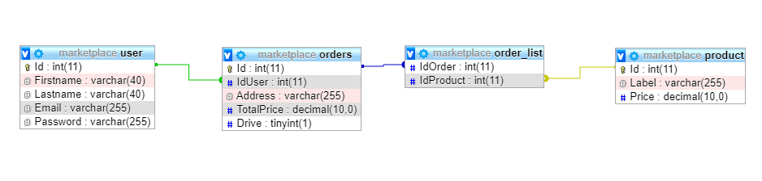

# Php training for autumn's intership (ULB)

Aim : Code a basic first-one PHP website, to master this techno and go in internship with good bases.

Three big points : 
- SQL Tables : 3 tables : User, Order, Product
- PHP code : safety, easy to use, usable
- CSS : at the end, make it beautifull (a bit...)

## SQL Tables 

### User 

| Colomne | Type   |
|---------|:------:|
|Id       |int     |
|Firstname|varchar |
|Lastname |varchar |
|Email    |varchar |
|Password |varchar |

### Order

| Colomne  | Type   |
|----------|:------:|
|Id        |int     |
|IdUser    |int     |
|Address   |varchar |
|TotalPrice|float   |
|Drive     |bool    |

### Product

| Colomne | Type   |
|---------|:------:|
|Id       |int     |
|Label    |varchar |
|Price    |varchar |

### ProductsList

This table will be used to put products into an order

| Colomne | Type   |
|---------|:------:|
|IdOrder  |int     |
|IdProduct|varchar |

Database Diagram : 

